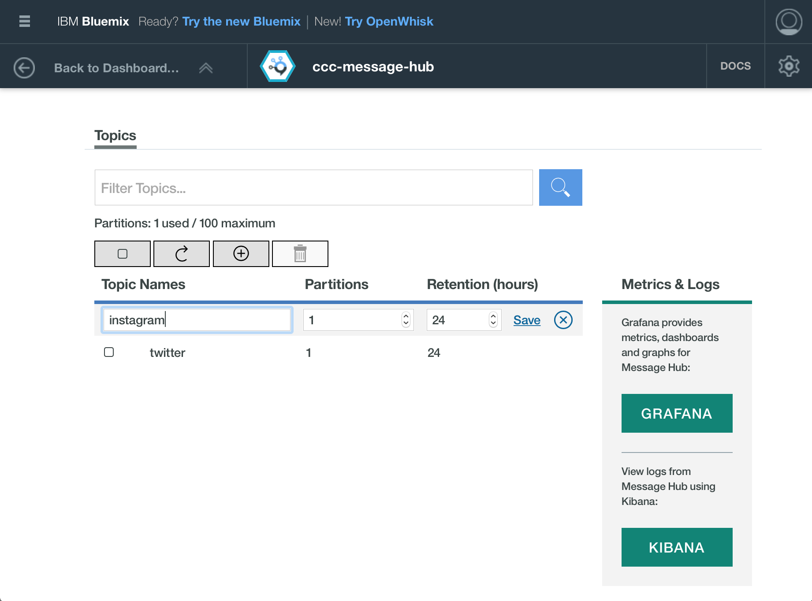

# Message Hub Example Code

## Message Hub
IBM Message Hub is a Bluemix managed instance of Apache Kafka, a massively scalable message queue architected as a distributed transaction log. Kafka was originally developed at LinkedIn before being open sourced. Used by Walmat, Netflix, Uber and Betfair

A new Message Hub instance can be created using the Bluemix dashboard.

### Producers
Producers are responsible for putting data on to Message Hub, publishing messages to a specific topic.

### Topics
Topics are used to organise messages in to different queues. You send messages to a specific topic with the producer and receive messages for a specific topic in the consumer.

### Partitions
Partitions are used to subdivide a topic. A partition effectively gives you another queue, adding scalability (storage and throughput) to a topic without the developer having to deal with the underlying infrastructure. Partitions are also required to load balance messages between different consumers in a consumer group.

### Consumers
Consumers are responsible for taking messages from Message Hub on a specific topic.  Each client is given a unique client ID.

### Consumer Groups
Consumer groups organise consumer instances into groups. Grouping consumers allows for load balancing to take place between instances.

## Example Code
The Java code shows how to send and receive messages from Messgae Hub using the Apache Kafka libraries.  

### Producer.java
Producer.java creates a Kafka producer and adds a message on to Message Hub every second.

    KafkaProducer<String, String> kafkaProducer = new KafkaProducer<String, String>(properties);

    ...

    while(running){
			try {
				Date now = new Date();
				String message = now.toString();
				ProducerRecord<String,String> producerRecord = new ProducerRecord<String,String>(topic, message);
				kafkaProducer.send(producerRecord);
				logger.log(Level.INFO,"Added: " + message);
				Thread.sleep(1000);
			}
			catch (final Exception e) {
				logger.log(Level.ERROR, "Producer has failed with exception: " + e);
			}
		}

### Consumer.java
Consumer.java creates a Kafka consumer and reads messages from the Message Hub queue.

    KafkaConsumer<String,String> kafkaConsumer = new KafkaConsumer<String, String>(properties);

    ...

    while(running){
      try {
        Iterator<ConsumerRecord<String, String>> it = kafkaConsumer.poll(10000).iterator();
        kafkaConsumer.commitSync();
        while (it.hasNext()) {
          count++;
          ConsumerRecord<String, String> record = it.next();
          logger.log(Level.INFO, "Value: " + record.value() + " Count:"+count);
        }

      }
      catch (final Exception e) {
        logger.log(Level.ERROR, "Consumer has failed with exception: " + e);
      }
    }

### Editing configuration
The example code uses two configuration files.  

Kafka properties for both consumers and producers is in *resouces/kafka.properties* including the name of the topic to use (cscc.topic).  All the consumers and producers in the examples use this configuration file.

Only one producer is used in this example.  Its configuration can be set by copying *local-producer.env.template* to *local-producer.env* nad filling in the Message Hub username and password taken from the Bluemix dashboard.

Two consumers are used in this example.  Their configuration can be set by copying local-consumer-1.env.template to local-consumer-1.env and local-consumer-2.env.template to local-consumer-2.env and filling in the Message Hub username and password taken from the Bluemix dashboard.  The consumer properties files allow the consumer group to be set, this will be changed depending on how Message Hub is being used (see below).

### Setting up Topic
Topics need to be configured in the Message Hub administration panel before they can be used.

When creating a topic, you need to specify two properties: the maximum time period messages will stay on that queue for and how many partitions should be used for the topic.  A Message Hub partition is currently limited to 1GB of data.  Once full, the oldest messages will be removed to make way for new ones.

### Building and running examples
The code can be built from a script if your development machine has Java 7, Maven and Gradle installed.  If not, it can be built from a virtual machine using the Vagrant file.

        ./build.sh

### Single Consumer Example

        ./start-producer.sh
        ./start-consumer-1.sh

Message Hub acts as buffer with the producer and consumer decoupled.  The consumer will process the data as quickly as it can, but wont be overloaded with input data.  The consumer can disconnect and it will get data from where it left off (last commit).

### Multiple Consumers, Different Consumer Group Example
* Set each consumer to have a unique client ID
* Set each consumer to have a unique consumer group name

        ./start-producer.sh
        ./start-consumer-1.sh
        ./start-consumer-2.sh

Message Hub working on publish-subscribe model.  Each consumer gets all the messages.  If one disconnects and reconnects it will carry on from where it left off.

### Multiple Consumers, Same Consumer Group Example
* Set each consumer to have a unique client ID
* Set each consumer to have the same consumer group name

        ./start-producer.sh
        ./start-consumer-1.sh
        ./start-consumer-2.sh

Message Hub delivers each message to just one instance in a given consumer group.  This can be used for load balancing.  Default behavior is round-robin, but can be defined through the API.

Must have at least as many partitions as there are consumer groups to load balance across all the consumer groups.  It is ok to have more partitions as a single consumer group can span multiple partitions.

### Single Consumer, New Consumer Group Example
* Set consumer-1 to have a new consumer group name
* Leave consumer-2 with its existing consumer group name
* Set auto.offset.reset Kafka property to earliest

        ./start-producer.sh
        ./start-consumer-1.sh
        ./start-consumer-1.sh

With doing real time analytics you normally have to do a combination of real time processing and reading from stored values. Message Hub can be used as a Kappa Architecture, where there is no traditional data store, only an append-only immutable log.  The idea is that you store the transactions, not the calculated values.

In message hub you can reset the position in the log that you start processing from.  The default is to process from the last committed message, but this can be reset to the beginning in the API.  The other alternative is to use a new consumer group name (commits are stored against a consumer group).  If there is a new consumer group, Message Hub uses the auto.offset.reset configuration property to work out where in the queue to start from (e.g. earliest).

## References
https://en.wikipedia.org/wiki/Apache_Kafka
http://techblog.netflix.com/2016/04/kafka-inside-keystone-pipeline.html
https://eng.uber.com/streamific/
http://milinda.pathirage.org/kappa-architecture.com/
